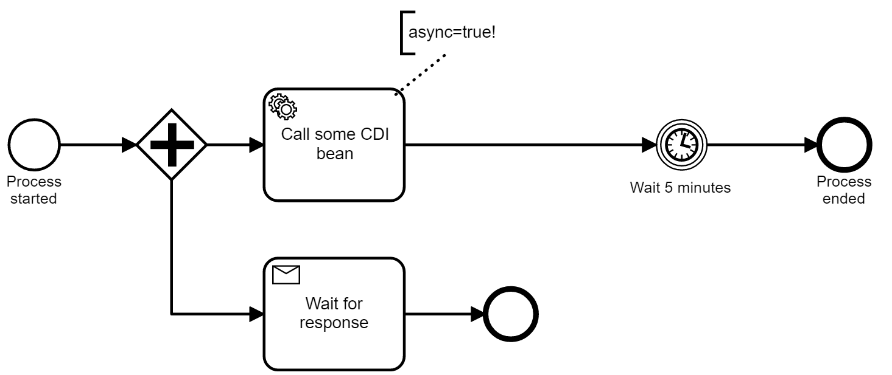
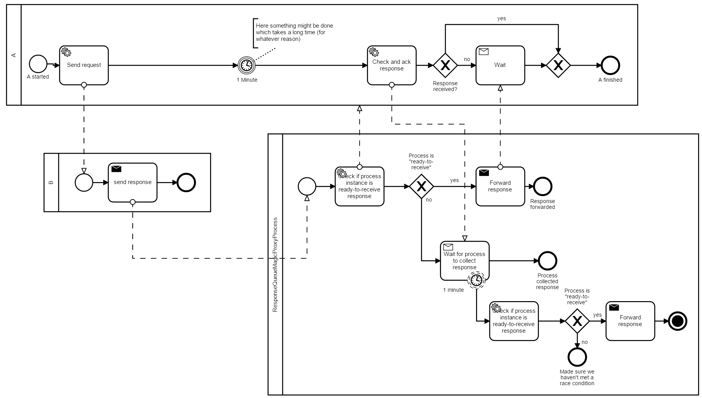

# Queuing response messages when a workflow instance is not ready-to-receive

Whenever you send in a message in a Camunda targeting a waiting workflow instance, it can only be correlated when the workflow instance is already *ready-to-receive*. That means, it arrived in a receive task or message event and the corresponding transaction has committed this state to the database.

If you send the response too quick or if your workflow instance does something else in the meantime, the message would get lost, meaning Camunda throws a `MismatchingMessageCorrelationException` to the client handing in that message. 

One approach to solve this problem is to use a parallel branch to start waiting immediately, but make sure you set [Transaction Boundaries](https://docs.camunda.org/manual/latest/user-guide/process-engine/transactions-in-processes/) correctly in order to really commit to the database before the message is sent.

Checkout and run the Application class which uses Spring Boot to startup Camunda. Now you can use the Tasklist to kick of workflow instances:

* [Camunda Welcome Page](http://localhost:8080/)
* User: demo
* Password: demo
* Start process: parallel-process

Another approach is to queue the message yourself, using JMS or other means. You can also implement this message buffering using Camunda itself, as shown in this example:

* [Camunda Welcome Page](http://localhost:8080/)
* User: demo
* Password: demo
* Start process: ready-to-receive-a

Sorry for any inconvenience, this example was produced in about an hour during a workshop ;-)
